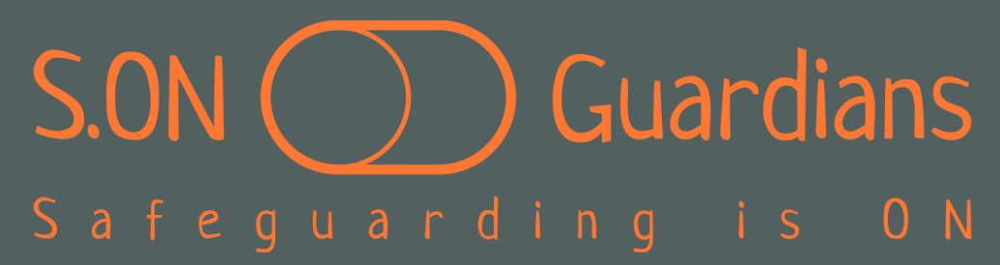

[S.ON logo](https://github.com/P1SMT/ci-hackathon1-safeguarding/blob/main/assets/img/logo-no-background.png)

## S.ON Guardians - Safeguarding is ON
S.ON Guardians is a website that aims to be a living hub for easily accessible information, helping raise awareness about safeguarding adults and children in the UK. The site is targeted for members of the UK public (non-professionals) who seek essential and comprehensive knowledge on identifying abuse, understanding safeguarding, as well as current practices, available resources and pointers for raising Safeguarding concerns, so that they feel more confident when they wish to act as guardians in their community, protecting individuals from harm and abuse.

## UX/UI Section
__Branding__ 

The _bright orange colour_ used on the S.ON logo and across the S.ON Guardians website was chosen because of its association with safety (safety vests in fluorescent yellow and bright orange are worn by various authorities because they provide the most visibility across a large variety of environments). 
SAFETY is the feeling we wish our users mentally associate with using the site and with acting on Safeguarding.

__Wireframes__

At the initial stages of design, simple wireframing served as a building block for bringing the website to life.

---
## EXISTING FEATURES
 
__Navigation Bar__

   * Featured on all three pages, the responsive navigation bar includes links to the S.ON Logo (which takes the user back to the home page), About, Adult Safeguarding and Children Safeguarding pages. The navigation bar is identical on each page to enable easy navigation.
   * This feature allows the user to easily navigate from page to page across all devices without having to revert back to the previous page using the "back" button on the browser.
   * On mobile devices the navigation bar is hidden under a toggle button, which when selected, displays the available pages in a row. The active page its coloured white, while the other pages remain orange - this way the user always knows where exactly they are on the website at any given moment.
   * We created a favicon - a switch - which is consistent with the S.ON branding and slogan "Safeguarding is ON" - visible on all devices, reminding the user that acting as a Safeguarding guardian is always a choice that is in their power to act on.

   

- __The landing page video__

  - The landing page includes a video which instantly grabs user's curiosity and invites interaction with the website. It also engages the user from the get-go in education on general Safeguarding concepts, which in turn serves them by increasing knowledge and confidence in identifying and discerning safeguarding incidents.

- __The Footer__ 

  - The footer section includes links to the relevant social media sites for S.ON Guardians. The links will open to a new tab to allow easy navigation for the user.
  - The footer is valuable to the user as it encourages them to keep connected via social media and it also provides contact details with the S.ON team.

- __Safeguarding Adults__

  - This section is valuable to the user as it clearly signposts that this is the place on the website where they can find resources specifically for safeguarding adults.
  - It includes a video that invites the user to interact with the website to access more knowledge, specifically about safeguarding adults.
  - It also includes resources (links, phone numbers, emails) to organisations which any member of the public can contact, depending on the type of concern the user has around safeguarding adults.

- __Safeguarding Children__

  - This section is valuable to the user as it clearly signposts that this is the place on the website where they can access information specifically for safeguarding children.
  - It includes a video that invites the user to interact with the content to get more knowledge, specifically about safeguarding children.
  - It also includes resources (links, phone numbers, emails) to organisations which any member of the public can contact, depending on the type of concern the user has around safeguarding children.

### Features Left to Implement

- A Sign-up form for users who would like to receive regular updates or knowledge nugets, to help them become better equipped guardians in their community. This was parked due to time constraints.
- The Navbar items displayed in bigger fonts and justified to the left for screens 1024px and larger, to enable a more visually pleasing display and a more effective real estate usage of the header. 

## Testing 

Creating the navbar posed several issues:
- firstly due to the logo icon not being displayed in full. After several testing and adjustments of the code, the logo is now fully displayed and occupies a third of the header on all screen sizes, however there's room for improvement - make it even more responsive for larger screens.
- secondly, the navbar items could do with better spacing and display on mobile devices. Time constraints meant we had to put functionality vs. esthetics first.

### Validator Testing 

* HTML
  - No errors were returned when passing through the official [W3C validator](https://validator.w3.org/nu/?doc=https%3A%2F%2Fcode-institute-org.github.io%2Flove-running-2.0%2Findex.html)
* CSS
  - No errors were found when passing through the official [(Jigsaw) validator](https://jigsaw.w3.org/css-validator/validator?uri=https%3A%2F%2Fvalidator.w3.org%2Fnu%2F%3Fdoc%3Dhttps%253A%252F%252Fcode-institute-org.github.io%252Flove-running-2.0%252Findex.html&profile=css3svg&usermedium=all&warning=1&vextwarning=&lang=en#css)

### Unfixed Bugs

- 

## Deployment

- The site was deployed to GitHub pages. The below steps were followed to deploy the S.ON Guardians: 
  - GitHub repository --> navigated to the Settings tab 
  - From the source section drop-down menu --> selected the Main Branch
  - Main branch selected --> the page will be automatically refreshed with a detailed ribbon display to indicate the successful deployment. 

The live link can be found here - https://code-institute-org.github.io/love-running-2.0/index.html 

## CREDITS

### Content 

- The text for the About page was generated using AI.
- The videos were sourced from YouTube.
- Instructions on how to implement the Navbar were taken from Bootstrap 5.2.3 and adding styles to it, in line with S.ON branding, was done based on learning from CI LMS.
- The icons in the footer were taken from [Font Awesome](https://fontawesome.com/)

### Media

- The favicon was initially generated through [logo.com](https://logo.com/) and tailored manually (button filled-in for better contrast) via Paint.
- The logo was generated using [logo.com](https://logo.com/).
